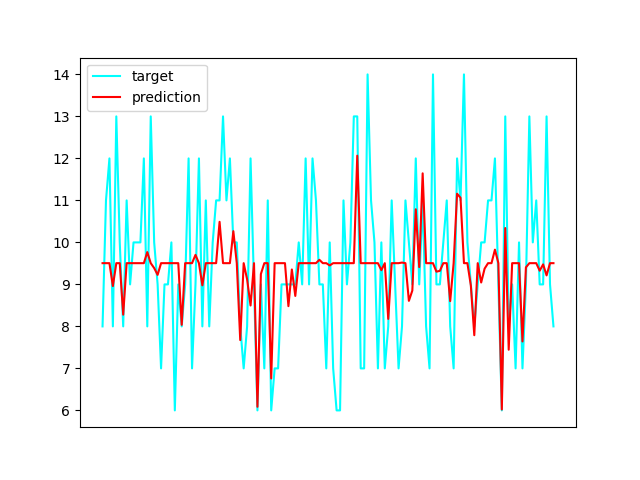
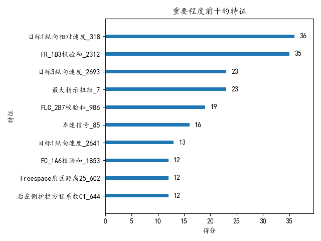
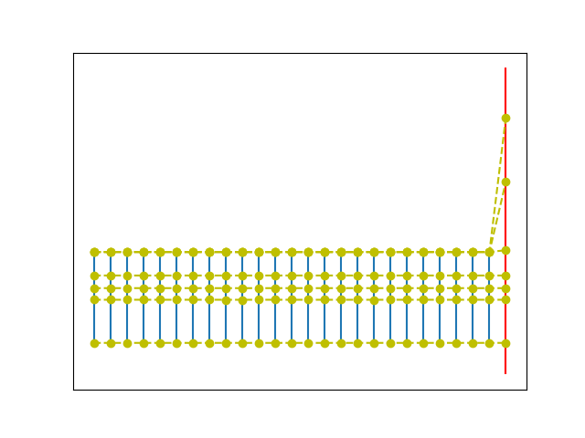
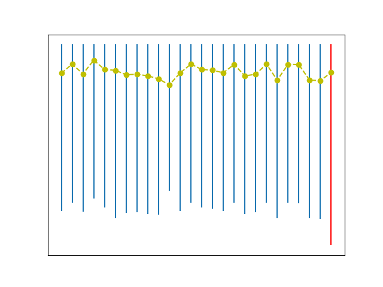

# 对图表的说明
- 
120条预测数据的预测目标和预测数据对比图，可以看出来虽然由于模型未经过调参，预测结果颇为不准确但是与实际结果的整体变化趋势还是一致的
- 
xgboost模型训练结果中最常被可视化的就是各个特征的重要程度了，在这里特征重要程度是指各个参与训练的特征对最终结果的贡献程度。在这里由于参与训练的特征多达2800+，所以只选取了特征重要程度前十的特征进行可视化
- 
训练数据生成的方式为：对于输入文件中的每一个数据，选取每一个特征读入文件中时间大于输出数据的第一个数据和其前一个数据的平均值作为相应特征的输入值, 如果所选取的数据超过了特征输入文件的最晚的时间那么选择最后（最晚）的那条数据。以上两图为文件处理方式的示意图，蓝线表示特征输入文件（为了可视化效果，此处只显示5个文件）时间轴，红线表示特征输出文件时间轴，黄点表示在各个文件中相对应训练数据（同样是为了可视化的效果，在第一张图中仅随机显示了5条数据；在第二张图中，显示的是第一条数据（时间最早)）

